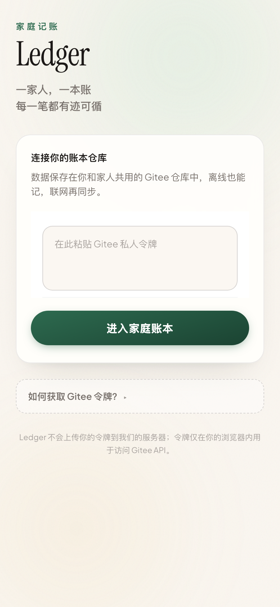

# Ledger（家庭记账）

纯前端的**协作式家庭记账 PWA**：无自建后端，账本以 **JSON** 存于你的 **Gitee 仓库**，通过分片与元数据（`meta.json` 等）做**增量同步**，适合家人共用同一仓库一起记账。

---

## 功能一览

| 能力 | 说明 |
|------|------|
| **登录与账本** | 支持 Gitee OAuth 或手动输入 Token；可创建/选择多本账，**一本账对应一个 Gitee 仓库**。 |
| **账本（首页）** | 展示**今日**流水；支持**按成员**的今日收支概览；流水卡片上**左滑**可删除，删除后通过同步逻辑**回滚对应账户余额**（支出加回、收入冲正、转账处理两端）。 |
| **记一笔** | 底部中央入口，**支出 / 收入 / 转账**；选分类、账户、金额与备注；分类与账户顺序等与「我的 / 资产」中的设置一致。 |
| **统计** | **收支构成**、按**周/月/年**与**成员**维度的饼图/折线等视图，支持在支出/收入与不同时间范围间切换。 |
| **资产** | 多账户、**账户类型**与列表图标、余额展示；**左滑**调余额、**右滑**删除；与记账使用同一套账户数据。 |
| **我的** | 同步时间、**支出/收入分类管理**、**账户显示顺序**、昵称与退出等。 |
| **离线优先** | 数据在 **IndexedDB** 中暂存与合并，联网后由调度器**按需同步**到 Gitee。 |
| **PWA** | 可「安装到桌面」、独立窗口与基础离线缓存（见 `vite-plugin-pwa` 配置）。 |

---

## 界面截图

下列文件位于仓库 [`docs/screenshots/`](./docs/screenshots/)：

| 文件 | 说明 |
|------|------|
| `login.png` | **本地 dev 真实截取**的登录页（无需令牌即可导出）。 |
| `home.png` | 账本首页（需在本机运行导出脚本并配置令牌后生成）。 |
| `stat.png` | 统计页 |
| `assets.png` | 资产页 |
| `record.png` | 「记一笔」弹层 |

<p align="center">
  
</p>

主界面为底部 **账本 / 统计 / 资产 / 我的** 四栏，中间为 **记一笔** 入口；顶栏可查看**同步状态**并手动触发同步。

### 能否由他人代替登录并截图？

**不能。** 登录依赖你的 **Gitee 私人令牌**（或 OAuth 授权），任何人都不应在聊天或脚本仓库中交换真实令牌。自动化助手无法在不经你授权的情况下替你在 Gitee 上登录。

### 在本机生成「登录以外」的真实截图

首次使用需安装 Playwright 浏览器内核（仅需一次）：

```bash
pnpm exec playwright install chromium
```

1. 终端 A：`pnpm dev`（记下控制台里的本地地址，例如 `http://127.0.0.1:5173/`；若端口被占用，可能是 `5174`、`5177` 等）。
2. 终端 B：在项目根目录维护 **`.env.local`**（已由 `.gitignore` 的 `*.local` 忽略；可参考 `.env.example`），写入 `GITEE_TOKEN=` 与可选 `BASE_URL=`；**不要** `git add` 该文件。然后执行：

```bash
pnpm screenshots:readme
```

亦可临时用环境变量（勿写入仓库）：

```bash
export BASE_URL=http://127.0.0.1:5177
export GITEE_TOKEN=你的私人令牌
pnpm screenshots:readme
```

成功后会在 `docs/screenshots/` 下写入（或覆盖）`home.png`、`stat.png`、`assets.png`、`record.png`；仅导出登录页时可省略 `GITEE_TOKEN`。

脚本路径：`scripts/capture-readme-screenshots.mjs`。

---

## 技术栈

- **Vue 3**（`<script setup>` + TypeScript）+ **Vite 8** + **vue-router**（**内存 history**，地址栏不随路由变化）
- **Vant 4** 移动端组件 + **Tailwind CSS 4**
- **vite-plugin-pwa**（Workbox）
- **IndexedDB**（`idb`）+ 自研 **Tidal** 同步层与 **Stash** 队列
- 代码风格：**Biome**、**Conventional Commits**（Husky + commitlint）
- 文档截图：**Playwright**（仅开发依赖，用于维护 README 配图）

---

## 快速开始

```bash
pnpm install
pnpm dev      # 开发服务（--host，便于局域网调试）
pnpm lint     # vue-tsc + Biome（仅 error）
pnpm build    # 先 lint 再生产构建
pnpm check    # Biome 写入式格式化与部分自动修复
```

---

## 环境变量

在 `.env` 或部署平台中配置（`VITE_` 前缀，由 Vite 注入）：

| 变量 | 含义 |
|------|------|
| `VITE_LOGIN_API_HOST` | 若使用 OAuth 登录，对接登录/回调服务 |
| `VITE_RATE_API_HOST` | 若使用在线汇率类能力 |
| `VITE_GTAG_SCRIPT` | 可选：Google Analytics 脚本 |

---

## 仓库结构（节选）

| 路径 | 说明 |
|------|------|
| `src/pages/` | 登录、账本选择、账本/统计/资产/我的及子页（分类管理、账户排序等） |
| `src/router/` | 路由与导航守卫；Token：`localStorage` 键 `gitee_user_token`，当前账本：`selected_book_id` |
| `src/tidal/` | 与远端交互的同步引擎（结构拉取、分片、上传） |
| `src/database/` | IndexedDB、Stash、调度器 |
| `src/api/endpoints/gitee/` | Gitee 端点实现，对外呈现 `SyncEndpoint` |
| `src/ledger/` | 账单/分类/账户等类型、中文分类预设、账户展示与排序等 |
| `src/sync/` | 与同步相关的迁移、交易对账户余额的增量等 |
| `scripts/capture-readme-screenshots.mjs` | 生成本地真实界面截图（README 用） |

更细的协作与数据模型说明，可结合 `CLAUDE.md`（若仓库中提供）与源码阅读。

---

## 数据与协作要点

- 每本账对应一个 Gitee 仓库存储；**协作者**对同一仓库有写权限时，多设备/多人通过**拉取 + 本地合并 + 再上传**协同。
- 业务数据以**交易（transactions）**、**账户（profile 中账户列表）**、**用户与 meta（分类等）**等形式落地，具体形状见 `src/ledger/type.ts` 与同步迁移逻辑。

---

## 参与贡献

1. 提交前执行 `pnpm lint`；提交说明遵循 Conventional Commits（如 `feat:`、`fix:`）。
2. 报告问题时请说明复现步骤、浏览器/系统与是否使用 PWA。

---

## 许可证

见仓库根目录 [LICENSE](./LICENSE)（**CC BY-NC-SA 4.0**）。
