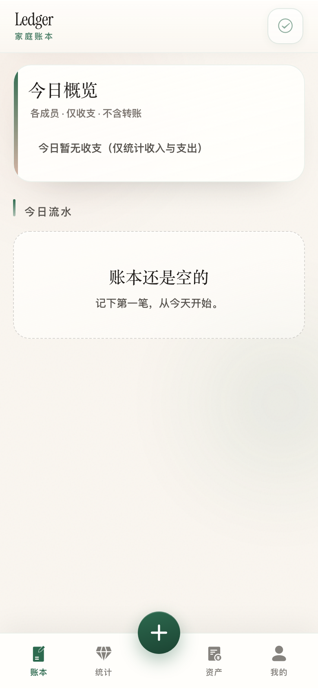
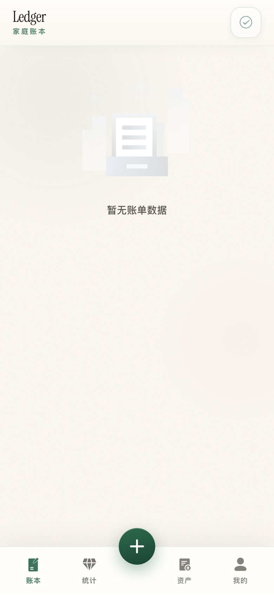
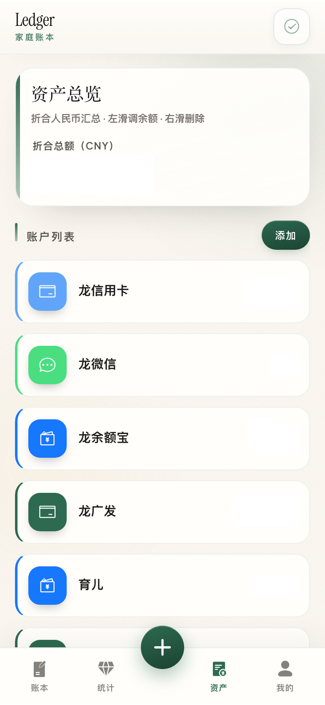
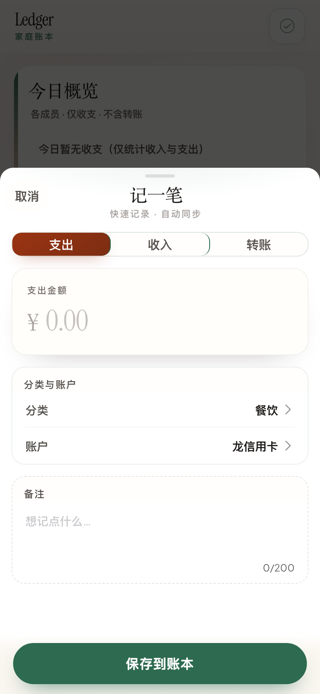

# Ledger（家庭记账）

纯前端的**协作式家庭记账 PWA**：无自建后端，账本以 **JSON** 存于你的 **Gitee 仓库**，通过分片与元数据（`meta.json` 等）做**增量同步**，适合家人共用同一仓库一起记账。

---

## 功能一览

| 能力 | 说明 |
|------|------|
| **登录与账本** | 在浏览器内粘贴 **Gitee 私人令牌**；可创建 / 选择多本账，**一本账对应一个 Gitee 仓库**。 |
| **账本（首页）** | 默认展示**今日流水**，按日期分组显示；流水卡片显示**账户信息**；支持**搜索/筛选**（关键词、金额范围、日期范围、成员、类型）；卡片**侧滑编辑/删除**，删除后同步端回滚相关账户余额。 |
| **记一笔** | 底部中间入口：**支出 / 收入 / 转账**；选分类、账户、金额与备注等；账户顺序等与资产页 / meta 一致；支持**编辑已有流水**。 |
| **统计** | 收支构成、按分类或成员的拆分视图、本月收支趋势折线等（可按周 / 月 / 年、支出 / 收入切换）。 |
| **资产** | 多账户与余额；账户类型与列表图标；账户卡片**侧滑**可调余额与删除。 |
| **我的** | 上次同步时间、支出 / 收入分类管理、账户显示顺序、**周期记账**（自动生成固定收支）、昵称编辑与退出登录。 |
| **统计** | 收支构成、按分类或成员的拆分视图、本月收支趋势折线等（可按周 / 月 / 年、支出 / 收入切换）。 |
| **资产** | 多账户与余额；账户类型与列表图标；账户卡片**侧滑**可调余额与删除。 |
| **我的** | 上次同步时间、支出 / 收入分类管理、账户显示顺序、昵称编辑与退出登录。 |
| **离线优先** | 数据存 **IndexedDB**，联网后由调度器同步到 Gitee。 |
| **PWA** | 可通过 `vite-plugin-pwa` 安装与离线缓存静态资源（具体行为见构建配置）。 |

---

## 界面截图

以下为仓库目录 [`docs/screenshots/`](./docs/screenshots/) 中的 PNG（由本地运行应用截取），对应上文「功能一览」。顶栏可查看同步状态；底部为 **账本 / 统计 / 资产 / 我的**，中间为 **记一笔**。

> 说明：以下使用 **Markdown 图片** 与相对路径 `./docs/screenshots/…`，在 Gitee / GitHub 网页上通常可直接预览；若仍不显示，请确认这些 PNG 已提交到当前分支。

**登录** · 粘贴 Gitee 私人令牌


**账本** · 流水列表与搜索筛选



**统计** · 收支构成与趋势等



**资产** · 账户列表与余额



**记一笔** · 支出 / 收入 / 转账



如需在本机重新导出或更新上述 PNG，见下文「在本机生成真实截图」。

### 能否由他人代替登录并截图？

**不能。** 登录依赖你的 **Gitee 私人令牌**，不应在聊天或仓库中交换。

### 在本机生成「登录以外」的真实截图

首次使用需安装 Playwright 浏览器内核（仅需一次）：

```bash
pnpm exec playwright install chromium
```

1. 终端 A：`pnpm dev`（记下控制台地址，如 `http://127.0.0.1:5173/`；端口被占用时可能是 `5174`、`5177` 等）。
2. 终端 B：在项目根目录维护 **`.env.local`**（已由 `.gitignore` 忽略），写入 `GITEE_TOKEN=` 与可选 `BASE_URL=`；**不要** `git add` 该文件。然后：

```bash
pnpm screenshots:readme
```

亦可临时使用环境变量（勿写入仓库）：

```bash
export BASE_URL=http://127.0.0.1:5177
export GITEE_TOKEN=你的私人令牌
pnpm screenshots:readme
```

成功后可在 `docs/screenshots/` 得到 `home.png`、`stat.png`、`assets.png`、`record.png`；仅导出登录页时可省略 `GITEE_TOKEN`。脚本：`scripts/capture-readme-screenshots.mjs`。

---

## 技术栈

- **Vue 3**（`<script setup>` + TypeScript）+ **Vite 8** + **vue-router**（内存 history）
- **Vant 4** + 全局样式（`index.css`、`ledger-vant-theme.css` 等）
- **vite-plugin-pwa**（Workbox）
- **IndexedDB**（`idb`）+ **Tidal** 同步层与 **Stash** 队列
- **Biome**、**Conventional Commits**（Husky + commitlint）
- **Playwright**（开发依赖，用于 README 截图脚本）

---

## 快速开始

```bash
pnpm install
pnpm dev      # 开发服务（--host）
pnpm lint     # vue-tsc + Biome（仅 error）
pnpm build    # 先 lint 再生产构建
pnpm check    # Biome 写入式格式化与部分自动修复
```

---

## 仓库结构（节选）

| 路径 | 说明 |
|------|------|
| `src/pages/` | 登录、账本选择、账本 / 统计 / 资产 / 我的及子页 |
| `src/router/` | 路由与守卫；Token：`localStorage` 键 `gitee_user_token`，当前账本：`selected_book_id` |
| `src/tidal/` | 与远端交互的同步引擎 |
| `src/database/` | IndexedDB、Stash、调度器 |
| `src/api/endpoints/gitee/` | Gitee 端点、`SyncEndpoint` |
| `src/ledger/` | 账单 / 分类 / 账户等类型与预设 |
| `src/sync/` | 同步迁移、交易对账户余额等 |
| `scripts/capture-readme-screenshots.mjs` | README 截图脚本 |

---

## 数据与协作要点

- 每本账对应一个 Gitee 仓库；多人对同一仓库有写权限时，通过拉取、本地合并与上传协同。
- 业务数据形态见 `src/ledger/type.ts` 与同步相关代码。

---

## 参与贡献

1. 提交前执行 `pnpm lint`；提交说明遵循 Conventional Commits（如 `feat:`、`fix:`）。
2. 报告问题时请说明复现步骤与运行环境。

---

## 许可证

见仓库根目录 [LICENSE](./LICENSE)（**CC BY-NC-SA 4.0**）。
